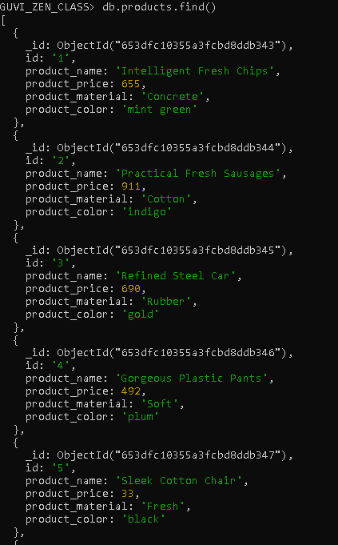
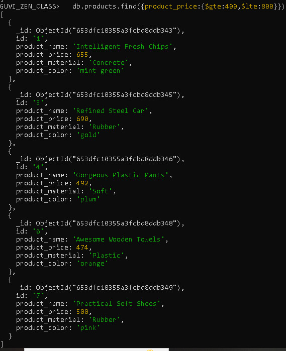
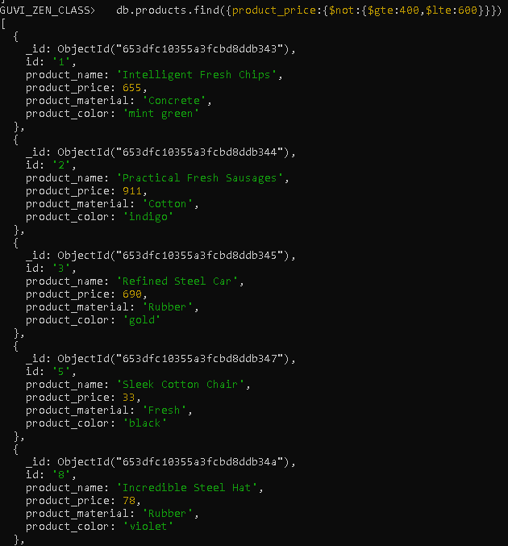
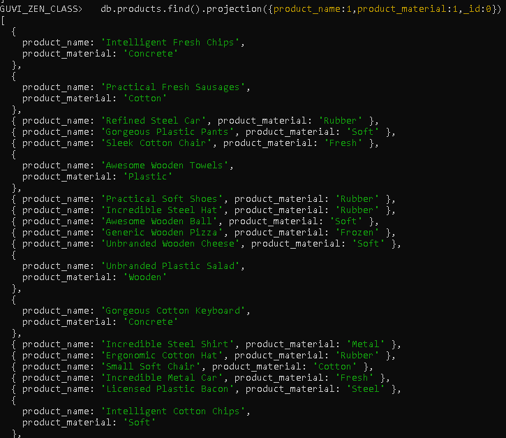
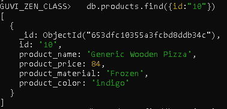
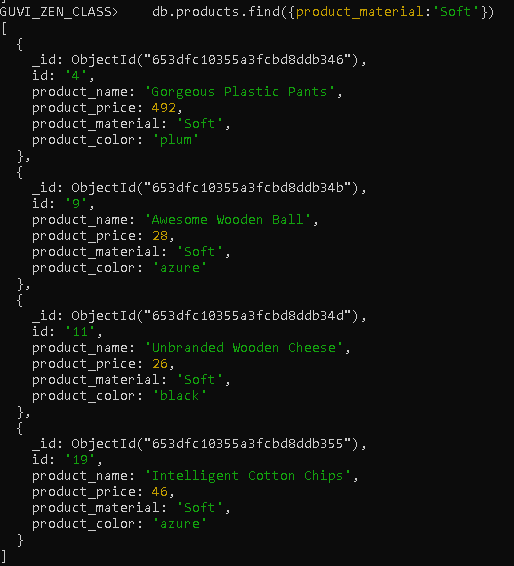
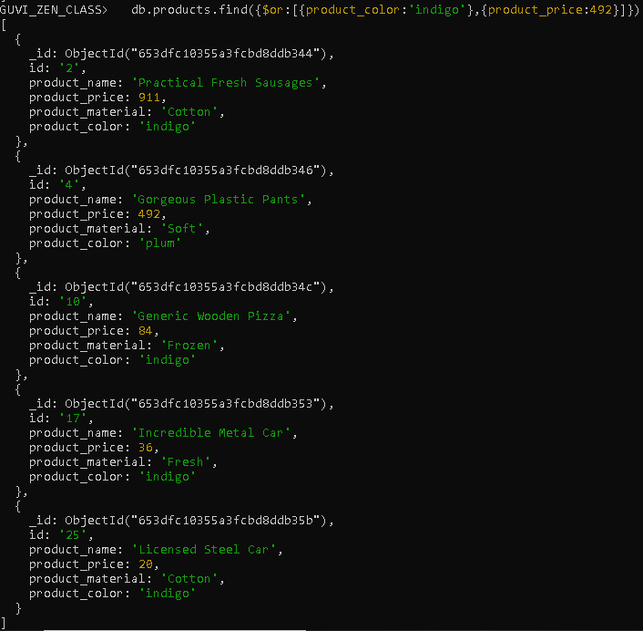
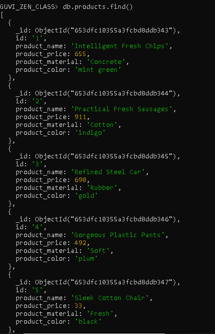

***** MONGODB QUERIES *****

1. Find all the information about each products
```
      db.products.find()
```



2. Find the product price which are between 400 to 800

         db.products.find({product_price:{$gte:400,$lte:800}})

       


3. Find the product price which are not between 400 to 600

         db.products.find({product_price:{$not:{$gte:400,$lte:600}}})




4. List the four product which are grater than 500 in price

         db.products.find({product_price:{$gt:500}}).limit(4)

.PNG)


5. Find the product name and product material of each products

         db.products.find().projection({product_name:1,product_material:1,_id:0})




6. Find the product with a row id of 10

         db.products.find({id:"10"})




7. Find only the product name and product material

         db.products.find().projection({product_name:1,product_material:1,_id:0})


8. Find all products which contain the value of soft in product material 

          db.products.find({product_material:'Soft'})




9. Find products which contain product color indigo  and product price 492.00

         db.products.find({$or:[{product_color:'indigo'},{product_price:492}]})



  ```
    db.products.find({$and:[{product_color:'indigo'},{product_price:492}]})
  ```

 NO-OUTPUT SInce there is no object that has both color and price as mentioned


10. Delete the products which product price value are same

         db.products.aggregate([
           { $group: { _id: "$product_price", count: { $sum: 1 } } },
           { $match: { count: { $gt: 1 } } },
        ])
        .forEach((doc) => {
           db.products.deleteMany({ product_price: doc._id });
        });


